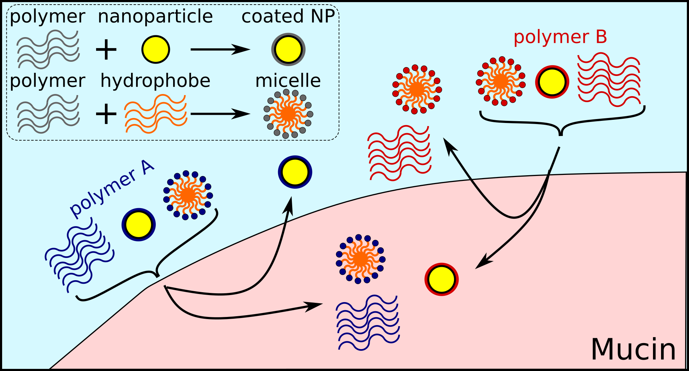

## DISCO-NP Manuscript Repository
#### Jeffrey Watchorn<sup>1</sup>, Samantha Stuart, Aaron J. Clasky, Matthew H. Oliveira, Darcy C. Burns, Frank X. Gu
**<sup>1</sup>Department of Chemical Engineering and Applied Chemistry, University of Toronto, Toronto, Ontario, Canada**
**Institute of Biomedical Engineering, University of Toronto, Toronto, Ontario, Canada**
**Division of Engineering Science, University of Toronto, Toronto, Ontario, Canada**
**Department of Chemistry, University of Toronto, Toronto, Ontario, Canada**


This repository is intended as supporting information (containing raw data and code to generate the figures) for the following publication:

*Transfer-base nuclear magnetic resonance uncovers unique mechanisms for protein-polymer and protein nanoparticle binding*



--------
### Environment Setup Steps:
1) Clone Repository to local machine
2) Create new python environment
3) Activate environment, navigate to this repository's home directory
4) Run `pip install -r requirements.txt` in terminal
5) Set up science plots matplotlib style
* For detailed instructions on installing the science plots matplotlib style and LaTex see: https://github.com/garrettj403/SciencePlots
6) (optional, for colour reproducibility) add disco library custom colour cycler file to your matplotlib styles

* i) find .matplotlib dir on your machine
`>>> import matplotlib as mpl`
`>>> mpl.get_configdir()`
* ii) show hidden files, navigate to dir/stylelib,
* iii) To use the default disco colours, move the discolib file associated with this repo:
    * `notebooks/utils/discolib.mplstyle` to 
    * `mpl.get_configdir()/stylelib`

* Colours are from the colorbrewer qualitative comparison palette: https://colorbrewer2.org/#type=qualitative&scheme=Set1&n=9

### How to cite
```
@article{TBD,
  title={Transfer-base nuclear magnetic resonance uncovers unique mechanisms for protein-polymer and protein nanoparticle binding},
  author={Watchorn, Jeffrey and Stuart, Samantha and Clasky, Aaron J. and Oliveira, Matthew H. and Burns, Darcy C. and Gu, Frank X.},
  journal={TBD},
  year={2023},
  publisher={TBD}
}
```

### License
MIT License